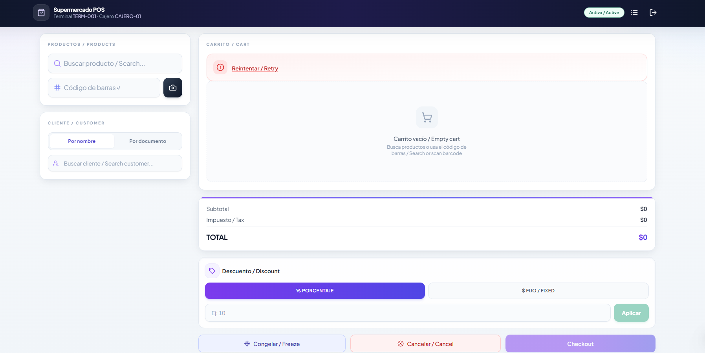

# Supermarket — taller POS (SDD)

Monorepo liviano: **documentación y especificaciones en la raíz**; **única aplicación web** aislada en su propia carpeta (sin mezclar con el futuro backend Java).

## Estructura

| Ruta | Contenido |
|------|------------|
| **`pos-frontend/`** | Cliente POS: React 18, TypeScript, Vite, Tailwind, MSW en desarrollo. **Todo el código de frontend vive aquí.** |
| **`docs/`** | Taller y SDD (`WORKSHOP-API.md`, `SDD-*-POS.md`). |
| **`.kiro/specs/`** | Especificaciones generadas con Kiro (`pos-frontend`, `pos-sales-platform`, etc.). |

No hay backend Spring en este repositorio por ahora; el front puede usar **MSW** (`VITE_USE_MSW=true`) o apuntar a una API real (`VITE_SALES_API_URL`).

## Interfaz — capturas / UI screenshots

Ejemplos del cliente web **Supermercado POS** (Vite dev, tema claro, bilingüe ES/EN).

### Inicio de sesión (`/login`)


Tarjeta centrada sobre fondo en degradado: identificadores de **cajero** y **terminal**, y pie con sesión demo local.

### Punto de venta (`/sale`)



Cabecera oscura con estado de venta, panel de búsqueda de productos y cliente, área del carrito, totales, descuentos y acciones Congelar / Cancelar / Checkout.

Las imágenes anteriores deben estar en `docs/screenshots/` con los nombres **`login.png`** y **`punto-de-venta.png`**. Si acabas de añadir capturas desde tu máquina, cópielas ahí antes de hacer commit (por ejemplo desde la carpeta de adjuntos del IDE).

## Arranque del frontend

```bash
cd pos-frontend
npm install --legacy-peer-deps
npm run dev
```

Opcional: renombrar `pos-frontend` → `frontend` cuando ningún proceso tenga la carpeta abierta (OneDrive/IDE a veces bloquean el cambio de nombre).
