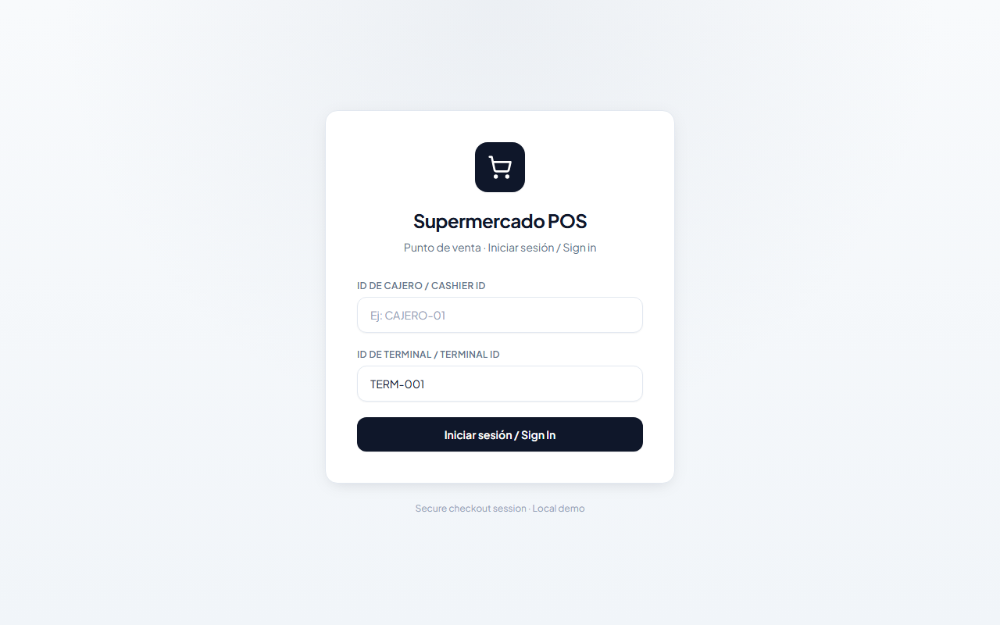
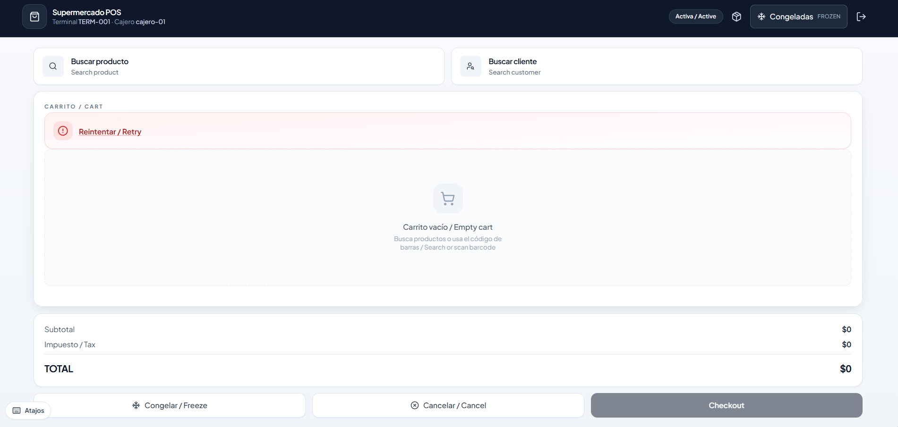
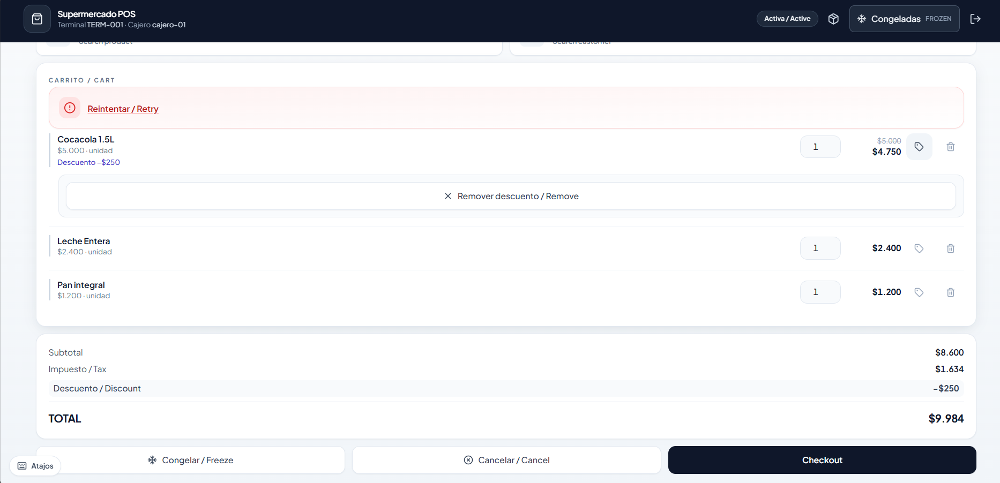
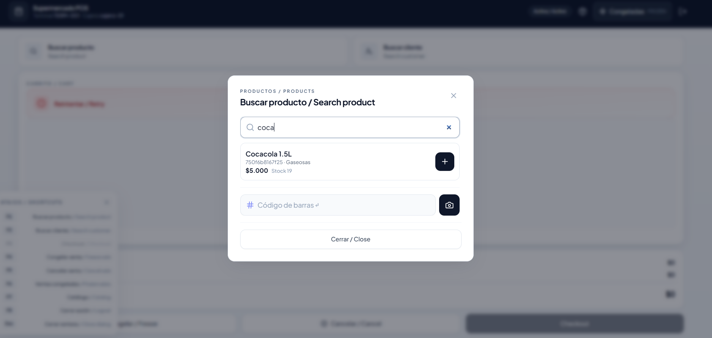
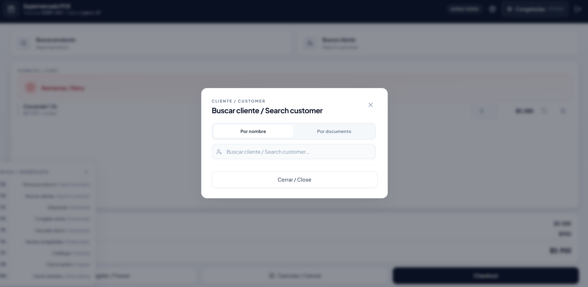
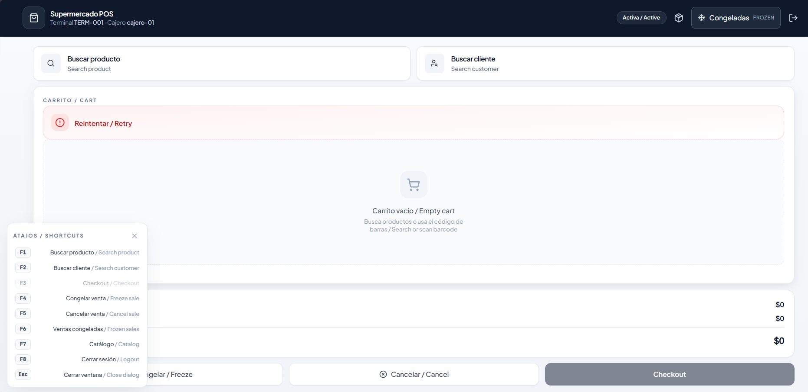
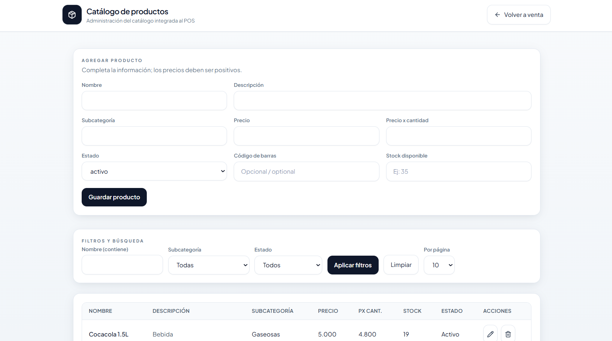
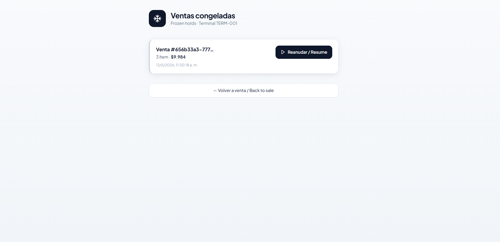
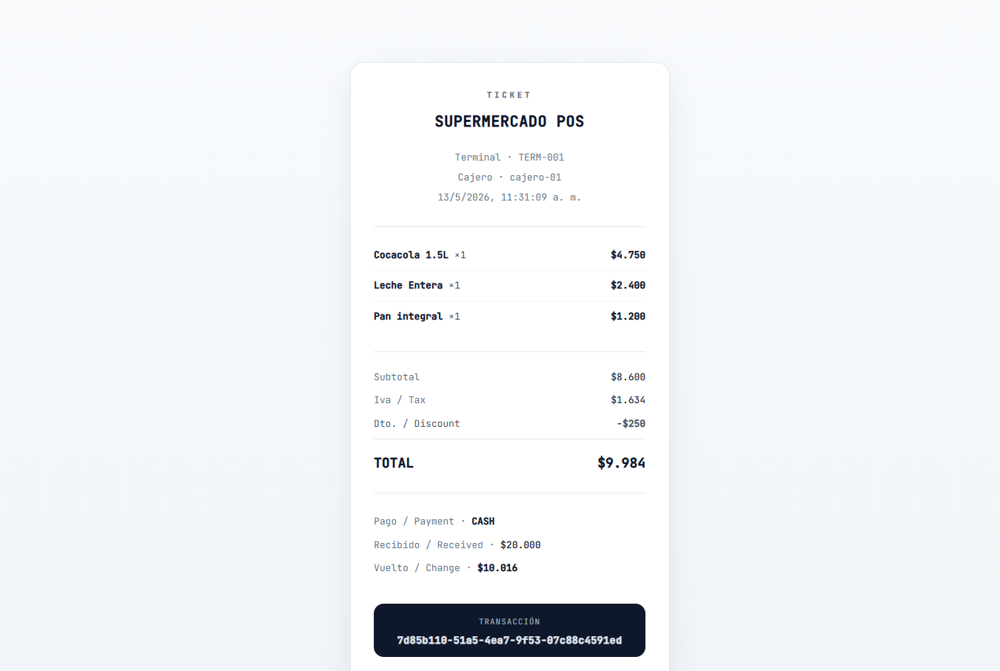

# Supermarket — taller POS (SDD)

Monorepo del **punto de venta** para supermercado: cliente web en React y **Sales API** en Spring Boot. La documentación de taller y especificaciones vive en `docs/` y `.kiro/specs/`; el código ejecutable está en `pos-frontend/` y `pos-sales-api/`.

## Estructura

| Ruta | Contenido |
|------|-----------|
| **`pos-frontend/`** | Cliente POS: React 18, TypeScript, Vite, Tailwind, Vitest. Pantallas de venta, catálogo, login de cajero, recibos y devoluciones. |
| **`pos-sales-api/`** | API REST Spring Boot (ventas, catálogo, health). Puerto por defecto **8088** en desarrollo. |
| **`docs/`** | Taller, SDD y capturas de interfaz (`docs/screenshots/`). |
| **`.kiro/specs/`** | Especificaciones generadas con Kiro. |
| **`start-dev.cmd` / `start-dev.ps1`** | Arranque conjunto API + frontend (prepara `.env`, libera puerto y ejecuta `npm run dev` en la raíz). |

En desarrollo, el front usa el proxy de Vite (`/api` → `127.0.0.1:8088`) con `VITE_SALES_API_URL` vacío. **MSW** solo aplica si `VITE_USE_MSW` no es `false`; el script de arranque lo desactiva para trabajar contra la API real.

## Requisitos

| Herramienta | Uso |
|-------------|-----|
| **Node.js** 18+ y **npm** | Frontend y scripts del monorepo (`concurrently`, `wait-on`). |
| **JDK 17** | Compilar y ejecutar `pos-sales-api` (Spring Boot 3.2). |
| **Apache Maven 3.9+** | `run-api.cmd` invoca Maven; por defecto busca `mvn.cmd` en `%LOCALAPPDATA%\Programs\apache-maven\apache-maven-3.9.6\bin\`. Ajusta la ruta en `run-api.cmd` si tu instalación es distinta. |

Comprueba versiones:

```powershell
node -v
npm -v
java -version
```

## Instalación (primera vez)

Desde la raíz del repositorio (`supermarket/`):

1. Clona o descarga el repo y abre una terminal en esa carpeta.
2. Instala dependencias del monorepo (orquestación API + web):

```powershell
npm install
```

3. Instala dependencias del frontend:

```powershell
npm install --legacy-peer-deps --prefix pos-frontend
```

4. Crea el entorno del cliente a partir del ejemplo (si no existe):

```powershell
Copy-Item pos-frontend\.env.example pos-frontend\.env
```

5. La primera vez que arranques la API, Maven descargará dependencias de `pos-sales-api` (puede tardar varios minutos).

El script `start-dev.ps1` repite los pasos 2–4 si faltan `node_modules` o `.env`; conviene ejecutarlos una vez a mano para ver errores de red o permisos.

## Arranque conjunto (backend + frontend)

Desde la raíz del repositorio:

```powershell
.\start-dev.cmd
```

En PowerShell también puedes usar:

```powershell
.\start-dev.ps1
```

Equivalente manual (misma lógica que el script):

```powershell
npm run dev
```

Qué hace el arranque conjunto:

- Libera el puerto **8088** si quedó ocupado.
- Levanta la **Sales API** en `http://127.0.0.1:8088` (health: `GET /api/v1/health`).
- Espera a que la API responda y luego inicia **Vite** (suele publicar `http://localhost:5173/`).
- En el front, las peticiones a `/api` se reenvían al backend.

**Login en el navegador:** `http://localhost:5173/login` (sustituye el puerto si Vite muestra otro en la consola).

Por separado:

| Comando | Descripción |
|---------|-------------|
| `npm run dev:api` | Solo Sales API (puerto **8088**). |
| `npm run dev:web` | Solo Vite; la API debe estar ya levantada para operar ventas reales. |

Solo frontend con mocks (sin API):

```powershell
cd pos-frontend
npm run dev
```

En ese modo deja `VITE_USE_MSW=true` en `pos-frontend/.env`.

## Cambios recientes del proyecto

- **Monorepo operativo:** `npm run dev` en la raíz levanta la API y espera `GET /api/v1/health` antes del cliente Vite.
- **Sesión de cajero:** login por `cashierId` y `terminalId` (persistencia en `pos-session`); la API recibe el cajero vía cabecera configurada.
- **Venta:** carrito a pantalla completa; búsqueda de producto y cliente en modales; atajos **F1–F8** con panel ocultable.
- **Descuentos por línea** en carrito y totales alineados en backend y frontend.
- **Catálogo integrado** (`/products`): alta, filtros, paginación y edición de productos.
- **Ventas congeladas** por terminal, checkout (efectivo/crédito), recibo y devoluciones.
- **Interfaz unificada:** paleta sobria (slate / blanco), tipografía Plus Jakarta Sans, componentes compartidos (`PosAppHeader`, `PosPageHero`, clases `pos-*` en `index.css`).

## Interfaz — capturas / UI screenshots

Ejemplos del cliente **Supermercado POS** (Vite + API local, tema claro sobrio, etiquetas bilingües ES/EN).

Las imágenes viven en **`docs/screenshots/`**. En GitHub solo se verán si están en el mismo commit que este README (`git add`, `git commit`, `git push`). Si un enlace se ve roto, comprueba el nombre exacto del archivo (mayúsculas y minúsculas cuentan en el servidor).

### Inicio de sesión (`/login`)



Tarjeta centrada sobre fondo neutro: icono de marca, campos **ID de cajero** y **ID de terminal** (por ejemplo `TERM-001`), validación en cliente y botón **Iniciar sesión / Sign In**. El pie indica sesión demo local.

### Punto de venta — vista general (`/sale`)



Cabecera oscura con terminal y cajero, accesos a catálogo, ventas congeladas y cierre de sesión. Zona de **Buscar producto** y **Buscar cliente**, carrito vacío con totales en cero y acciones **Congelar**, **Cancelar** y **Checkout**.

### Carrito con ítems y descuentos (`/sale`)



Líneas con cantidad editable, descuento por ítem, subtotal, impuesto, descuento global y **TOTAL** destacado. Misma barra de acciones inferior que en la vista general.

### Búsqueda de producto (modal)



Diálogo **Buscar producto**: filtro por nombre, resultado con precio y stock, escaneo o captura de código de barras y cierre del modal.

### Búsqueda de cliente (modal)



Alternancia **Por nombre** / **Por documento**, campo de búsqueda y pie **Cerrar**. Desde aquí se asocia el cliente a la venta activa.

### Atajos de teclado (`/sale`)



Panel **Atajos** anclado abajo a la izquierda (ocultable): producto, cliente, checkout, congelar, cancelar, congeladas, catálogo, logout y **Esc** para cerrar diálogos.

### Catálogo de productos (`/products`)



Formulario **Agregar producto**, **Filtros y búsqueda**, tabla paginada con stock y acciones de edición o eliminación. Cabecera con retorno a venta.

### Ventas congeladas (`/sale/frozen`)



Listado por terminal con fecha, ítems, total y **Reanudar**; enlace **Volver a venta** al pie.

### Recibo tras checkout (`/receipt/:transactionId`)



Ticket con terminal, cajero, líneas, subtotal, IVA, descuento, total, pago en efectivo, vuelto e identificador de transacción.

**Incluir en el commit:** desde la raíz del repo, `git add docs/screenshots/*.png` junto con este `README.md`.
