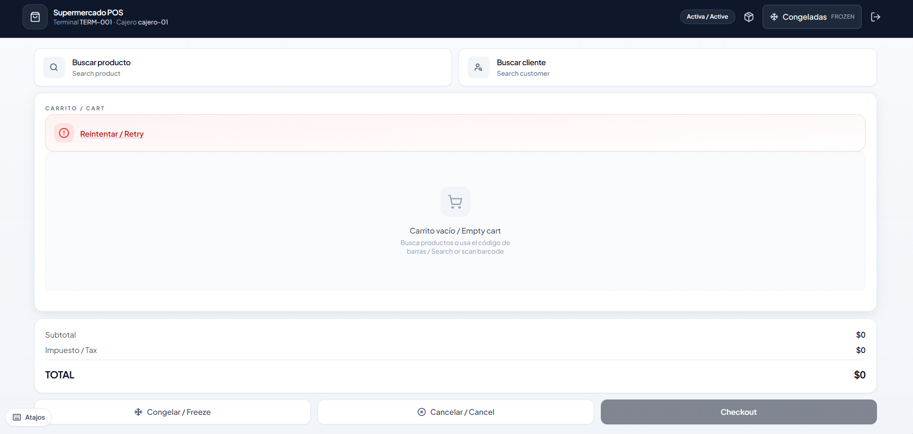

# Supermarket — POS (SDD)

Monorepo del **punto de venta** para supermercado: frontend React y backend **serverless** (Lambda + API Gateway + DynamoDB en LocalStack). Incluye modo opcional con Spring Boot (`pos-sales-api`).

**Repositorio:** https://github.com/yilgr19/Supermarket-DECO

## Estructura

| Ruta | Contenido |
|------|-----------|
| **`lambda-ventas/`** | Backend serverless: Java 17, SAM, 2 Lambdas, DynamoDB, tests JUnit. [README](lambda-ventas/README.md) |
| **`pos-frontend/`** | Cliente POS: React 18, TypeScript, Vite, Tailwind, Vitest. [README](pos-frontend/README.md) |
| **`scripts/`** | Deploy LocalStack, verificar ventas, recargar catálogo |
| **`docs/`** | Infraestructura, capturas, [guía de estudio](docs/GUIA-ESTUDIO-TECNICO.md) |
| **`.kiro/specs/`** | Specs SDD: `lambda-ventas/`, `pos-frontend/` |
| **`pos-sales-api/`** | API Spring Boot opcional (puerto **8088**) |

## Arquitectura (modo examen)

```
pos-frontend :5173
       │  VITE_API_BASE_URL
       ▼
API Gateway SupermarketAPI (LocalStack :4566)
       ├── GET  /api/productos      → Lambda productos-get
       └── POST /api/v1/ventas      → Lambda ventas-post
                    │
                    ▼
              DynamoDB Productos (catálogo + stock)
              DynamoDB Ventas      (registro de ventas)
```

- **Infraestructura:** se levanta con **scripts** (manual).
- **Ventas y stock:** se procesan **automáticamente** en cada POST a `/api/v1/ventas`.

---

## Inicio rápido

Desde la raíz del repo. **Git Bash** para scripts; **PowerShell** para el frontend.

```bash
# 1. LocalStack activo
curl -s http://localhost:4566/_localstack/health

export AWS_PROFILE=localstack AWS_DEFAULT_REGION=us-east-1 AWS_ENDPOINT_URL=http://localhost:4566

# 2. Compilar y desplegar Lambdas
bash scripts/build-and-deploy-lambdas.sh

# 3. Tablas, catálogo y API Gateway (copiar BASE_URL al .env)
bash scripts/localstack-setup-api.sh
```

```powershell
# 4. Frontend (editar pos-frontend/.env.development con BASE_URL)
cd pos-frontend
npm run dev
# → http://localhost:5173/login
```

> En **Git Bash** sin AWS CLI instalado, los scripts usan `wsl aws` automáticamente.

---

## Requisitos

### Modo Lambda + LocalStack (recomendado — examen)

| Herramienta | Uso |
|-------------|-----|
| **Docker** | LocalStack en puerto **4566** |
| **Git Bash** o **WSL** | Scripts de deploy y verificación |
| **AWS CLI** (WSL o Windows) | DynamoDB, Lambdas, API Gateway |
| **JDK 17+** + **Maven 3.9+** | Compilar Lambdas |
| **Node.js 18+** | Frontend y seed de catálogo |
| **AWS SAM CLI** | Opcional (`mvn package` si no está instalado) |

### Modo Spring Boot (opcional — taller)

| Herramienta | Uso |
|-------------|-----|
| **JDK 17** + **Maven** | `pos-sales-api` |
| **Node.js 18+** | Frontend con proxy Vite → `:8088` |

---

## Instalación (primera vez)

```powershell
npm install
npm install --legacy-peer-deps --prefix pos-frontend
Copy-Item pos-frontend\.env.example pos-frontend\.env.development
```

Perfil AWS para LocalStack (`~/.aws/credentials`):

```ini
[localstack]
aws_access_key_id = test
aws_secret_access_key = test
```

---

## Cómo correr el proyecto (Lambda + LocalStack)

### 1. Variables de entorno

```bash
export AWS_PROFILE=localstack
export AWS_DEFAULT_REGION=us-east-1
export AWS_ENDPOINT_URL=http://localhost:4566
```

### 2. Compilar y desplegar Lambdas

```bash
bash scripts/build-and-deploy-lambdas.sh
```

Solo desplegar (JAR ya compilado):

```bash
bash scripts/localstack-deploy-lambdas.sh
```

### 3. Tablas, catálogo y API Gateway

```bash
bash scripts/localstack-setup-api.sh
```

Al final imprime:

```text
BASE_URL=http://localhost:4566/restapis/<API_ID>/prod/_user_request_
```

### 4. Configurar frontend

`pos-frontend/.env.development`:

```env
VITE_API_BASE_URL=http://localhost:4566/restapis/TU_API_ID/prod/_user_request_
VITE_USE_MSW=false
VITE_SALES_API_URL=
VITE_TERMINAL_ID=TERM-001
VITE_STORE_NAME=Supermercado POS
```

### 5. Iniciar frontend

```powershell
cd pos-frontend
npm run dev
```

### 6. Flujo de prueba

1. Login (`CAJERO-01` / `TERM-001`).
2. Buscar producto (mín. 2 caracteres) → `GET /api/productos`.
3. Agregar al carrito → **Checkout efectivo**.
4. Recibo con `idVenta` (`VNT-...`). Primera venta puede tardar ~15–20 s (cold start JVM).

---

## Verificación operativa

### Confirmar ventas en DynamoDB

Tras el checkout, copia el `idVenta` del recibo.

```bash
# Una venta
bash scripts/consultar-venta.sh VNT-1780078872579

# Todas las ventas
bash scripts/consultar-venta.sh
```

**Probar POST manual:**

```bash
curl -s -X POST "http://localhost:4566/restapis/TU_API_ID/prod/_user_request_/api/v1/ventas" \
  -H "Content-Type: application/json" \
  -d '{"items":[{"id":"prod-001","nombre":"Arroz 1kg","precio":4500,"cantidad":1}],"descuento":0}'
```

Respuesta esperada: **201** con `idVenta`, `subtotal`, `iva`, `total`.

**Verificar descuento de stock:**

```bash
curl -s "http://localhost:4566/restapis/TU_API_ID/prod/_user_request_/api/productos/prod-001"
```

| Qué revisar | Cómo |
|-------------|------|
| Venta persistida | `consultar-venta.sh VNT-...` |
| Totales / IVA | Recibo o JSON del script |
| Stock actualizado | `GET /api/productos/{id}` + **F5** en el POS |

### Recargar catálogo tras editar `productos.json`

[`lambda-ventas/datos/productos.json`](lambda-ventas/datos/productos.json) es **semilla**: la Lambda lee **DynamoDB**, no el archivo en tiempo real.

```bash
bash scripts/seed-catalog.sh
```

Deberías ver `Productos cargados: N`. Luego **F5** en el navegador.

Setup completo (reinicio de LocalStack):

```bash
bash scripts/localstack-setup-api.sh
```

Verificar producto nuevo:

```bash
curl -s "http://localhost:4566/restapis/TU_API_ID/prod/_user_request_/api/productos/prod-004"
```

> El seed hace `put-item` (inserta/actualiza por `id`). No borra productos eliminados del JSON.

### Scripts de referencia

| Script | Cuándo usarlo |
|--------|----------------|
| [`build-and-deploy-lambdas.sh`](scripts/build-and-deploy-lambdas.sh) | Tras cambiar código Java |
| [`localstack-deploy-lambdas.sh`](scripts/localstack-deploy-lambdas.sh) | Solo subir JAR a LocalStack |
| [`localstack-setup-api.sh`](scripts/localstack-setup-api.sh) | Tablas + API Gateway + catálogo inicial |
| [`seed-catalog.sh`](scripts/seed-catalog.sh) | Tras editar `productos.json` |
| [`consultar-venta.sh`](scripts/consultar-venta.sh) | Verificar ventas en DynamoDB |

---

## Endpoints del API

| Método | Ruta | Descripción |
|--------|------|-------------|
| GET | `/api/productos` | Listar catálogo |
| GET | `/api/productos/{id}` | Detalle producto |
| POST | `/api/v1/ventas` | Registrar venta; descuenta stock (`{ items, descuento }`) |

Errores relevantes: **400** body inválido · **409** stock insuficiente · **404** producto no encontrado.

---

## Pruebas unitarias backend

```bash
# WSL (recomendado)
cd lambda-ventas && mvn test

# Windows PowerShell (si falla .m2)
cd lambda-ventas && .\mvn-test.ps1
```

11 tests (5 productos + 6 ventas, incluye stock 409).

---

## Modos alternativos

### Spring Boot + frontend

```powershell
.\start-dev.cmd
```

API en **http://127.0.0.1:8088**. Dejar **`VITE_API_BASE_URL` vacío** en `.env.development`.

### Mocks (sin backend)

```powershell
cd pos-frontend
# VITE_API_BASE_URL vacío, VITE_USE_MSW=true
npm run dev
```

---

## Proceso SDD

| Spec | Ubicación | Código |
|------|-----------|--------|
| Backend Lambda | [`.kiro/specs/lambda-ventas/`](.kiro/specs/lambda-ventas/) | `lambda-ventas/` |
| Frontend POS | [`.kiro/specs/pos-frontend/`](.kiro/specs/pos-frontend/) | `pos-frontend/` |

1. **requirements.md** — criterios de aceptación (PT-*, VT-*).
2. **design.md** — arquitectura y contratos HTTP.
3. **tasks.md** — tareas de implementación.

Documentación adicional: [lambda-ventas/README.md](lambda-ventas/README.md) · [INFRAESTRUCTURA-LOCALSTACK.md](docs/INFRAESTRUCTURA-LOCALSTACK.md) · [Guía de estudio](docs/GUIA-ESTUDIO-TECNICO.md)

---

## Evidencias de entrega

| Tipo | Carpeta |
|------|---------|
| Postman (GET, POST, errores) | [`docs/postman/`](docs/postman/) |
| `mvn test`, DynamoDB, `.env` | [`docs/test.env/`](docs/test.env/) |
| UI del POS | [`docs/screenshots/`](docs/screenshots/) |



Regenerar captura error API: `cd pos-frontend && npm run capture:error-screenshot`
