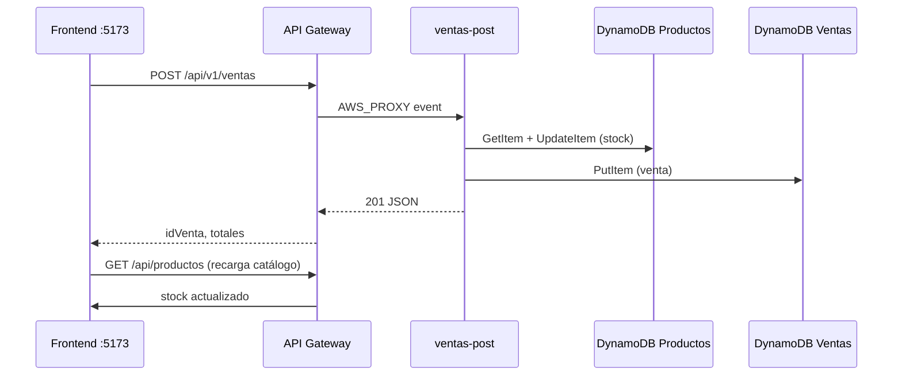

# Guía de estudio técnico — Supermarket POS (Lambda + React)

Documento de **auditoría final** contra los specs SDD (`.kiro/specs/`) y **material de repaso** para defensa oral o revisión del docente.

**Repositorio:** https://github.com/yilgr19/Supermarket-DECO  
**Fecha de revisión:** mayo 2026 (actualizada con stock, scripts Git Bash/WSL)

---

## Parte 1 — Auditoría de cumplimiento

### 1.1 Examen Codificación y pruebas (specs `.kiro/specs/lambda-ventas/`)

| # | Requisito del documento | Evidencia / ubicación | Estado |
|---|---------------------------|------------------------|--------|
| 1 | Specs SDD **antes** del código: `requirements.md`, `design.md`, `tasks.md` en `.kiro/specs/` | [`.kiro/specs/lambda-ventas/`](../.kiro/specs/lambda-ventas/) | ✅ |
| 2 | `template.yml` SAM: API Gateway + 2 Lambdas + 2 tablas DynamoDB | [`lambda-ventas/template.yml`](../lambda-ventas/template.yml) | ✅ |
| 3 | Lambda **GET productos** desde DynamoDB | `ProductosHandler.java` | ✅ |
| 4 | Lambda **POST ventas** en DynamoDB | `VentaHandler.java` | ✅ |
| 5 | Implementación trazable a `tasks.md` | IDs PT-* / VT-* en `requirements.md` | ✅ |
| 6 | Pruebas unitarias con **mocks** de DynamoDB | `ProductosHandlerTest`, `VentaHandlerTest` (**11 tests**) | ✅ |
| 7 | Casos: éxito, tabla vacía, error conexión, **stock insuficiente 409** | PT-1…PT-4, VT-1…VT-6 | ✅ |
| 8 | Criterios de prueba descritos en `requirements.md` | [requirements.md § Criterios](../.kiro/specs/lambda-ventas/requirements.md) | ✅ |
| 9 | Captura Postman **GET productos 200** | [`docs/postman/Get productos.png`](postman/Get%20productos.png) | ✅ |
| 10 | Captura Postman **POST ventas 201** | [`docs/postman/post ventas exito.png`](postman/post%20ventas%20exito.png) | ✅ |
| 11 | Captura **caso de error** (400 o producto inexistente) | [`post venta error.png`](postman/post%20venta%20error.png), [`Get producto no encontrado.png`](postman/Get%20producto%20no%20encontrado.png) | ✅ |
| 12 | Captura **`mvn test` BUILD SUCCESS** | [`docs/test.env/Test wsl.png`](test.env/Test%20%20wsl.png) | ✅ |
| 13 | Verificación persistencia venta (DynamoDB) | [`consultar venta realizada postman.png`](test.env/consultar%20venta%20realizada%20postman.png) | ✅ |
| 14 | Repo **GitHub público** | `origin` → Supermarket-DECO | ✅ |
| 15 | README: arquitectura, deploy, SDD, capturas, URL API | [`README.md`](../README.md), [`lambda-ventas/README.md`](../lambda-ventas/README.md) | ✅ |
| 16 | **`sam deploy` en AWS real** | Solo LocalStack en desarrollo; scripts manuales workaround CFN | ⚠️ Opcional |
| 17 | **Descuento de stock** al registrar venta | `VentaHandler.descontarStock()`, test 409, frontend valida stock | ✅ |

**Indicadores Saber (conceptos) — cómo demostrarlos en el repo:**

| Indicador (10–30%) | Dónde está reflejado |
|--------------------|----------------------|
| Tipos de prueba serverless (unitarias, integración, E2E) | Unitarias: JUnit+Mockito. Integración: Postman/curl + DynamoDB scan. E2E: frontend + LocalStack. |
| Shift-left / testing adelantado | Specs → tests (criterios PT/VT) → código → capturas Postman |
| Mocks/stubs para AWS | `DynamoDB` mockeado en tests; LocalStack como stub de AWS en dev |

**Pendiente menor (no bloquea entrega típica en taller):**

- Despliegue en **cuenta AWS real** (`sam deploy` sin LocalStack). El examen lo pide; en clase se usó LocalStack por equivalencia funcional. Si el docente lo exige, desplegar con credenciales AWS y actualizar URL en README.

---

### 1.2 Examen Desarrollo avanzado aplicaciones en red (specs `.kiro/specs/pos-frontend/`)

| # | Requisito del documento | Evidencia / ubicación | Estado |
|---|---------------------------|------------------------|--------|
| 1 | Specs SDD frontend en `.kiro/specs/` | [`.kiro/specs/pos-frontend/`](../.kiro/specs/pos-frontend/) | ✅ |
| 2 | HTML5 semántico, CSS (flex/grid), JS async | React genera markup semántico; Tailwind; `fetch`/`async` en adapters |
| 3 | Framework justificado en `design.md` | [design.md §11 Lambda](../.kiro/specs/pos-frontend/design.md) — React + hooks |
| 4 | Vista productos: GET, nombre, precio, selección | `ProductSearch.tsx`, [`buscarp.png`](screenshots/buscarp.png) | ✅ |
| 5 | Flujo ventas: POST, éxito y error | Checkout + [`factura.png`](screenshots/factura.png), [`error-api-caido.png`](screenshots/error-api-caido.png) | ✅ |
| 6 | URL API en **config** (`VITE_API_BASE_URL`), no hardcode | `pos-frontend/src/config/api.ts`, [`.env.development.png`](test.env/.env.development.png) | ✅ |
| 7 | Estructura repo (frontend + backend) | Monorepo: `pos-frontend/`, `lambda-ventas/` | ✅ |
| 8 | GitHub público + README documentado | Mismo repo | ✅ |
| 9 | Captura listado productos desde API | Postman + UI | ✅ |
| 10 | Captura venta exitosa con respuesta API | Postman 201 + recibo con `idVenta` | ✅ |
| 11 | Captura manejo de error | [`error-api-caido.png`](screenshots/error-api-caido.png) | ✅ |
| 12 | Sección Proceso SDD en README | [`README.md` § Proceso SDD](../README.md) | ✅ |
| 13 | Requisito 15 Lambda (integración examen) | `resolvePorts.ts`, adapters Lambda | ✅ |
| 14 | Validación de stock en checkout | `lambdaSaleApiAdapter.ts`, `CartPanel` error 409 | ✅ |

**Nota sobre rutas:** los specs usan **`GET /api/productos`** y **`POST /api/v1/ventas`** (documentado en `requirements.md` y `design.md`).

---

### 1.3 Resumen ejecutivo de la auditoría

| Área | Completitud |
|------|-------------|
| Specs SDD (backend + frontend) | 100 % |
| Código Lambda + tests unitarios (incl. stock) | 100 % |
| Infraestructura LocalStack + scripts Git Bash/WSL | 100 % |
| Integración frontend Lambda + descuento stock | 100 % |
| Evidencias Postman / mvn / DynamoDB / UI | 100 % |
| GitHub + README | 100 % |
| Deploy AWS producción | Opcional / no hecho |

**Conclusión:** el proyecto **cumple los requisitos de evaluación** para entrega con LocalStack. Solo queda como riesgo explícito el despliegue en AWS real si el docente lo exige al pie de la letra.

---

## Parte 2 — Arquitectura del sistema

### 2.1 Vista general

```
┌─────────────────┐     HTTP      ┌──────────────────┐
│  pos-frontend   │ ────────────► │  API Gateway     │
│  React + Vite   │               │  SupermarketAPI  │
│  :5173          │               │  (LocalStack)    │
└─────────────────┘               └────────┬─────────┘
                                           │ AWS_PROXY
                    ┌──────────────────────┼──────────────────────┐
                    ▼                      ▼                      │
            ┌───────────────┐      ┌───────────────┐              │
            │ productos-get │      │  ventas-post  │              │
            │ Java 17       │      │  Java 17      │              │
            └───────┬───────┘      └───────┬───────┘              │
                    │                      │                      │
                    ▼                      ▼                      │
            ┌───────────────┐      ┌───────────────┐              │
            │ DynamoDB      │      │ DynamoDB      │              │
            │ Productos     │◄─────│ Ventas        │              │
            │ (stock ↓)     │      │ (PutItem)     │              │
            └───────────────┘      └───────────────┘              │
                    LocalStack :4566 ◄────────────────────────────┘
```

### 2.2 Dos modos de backend

| Modo | Cuándo | Configuración |
|------|--------|---------------|
| **Lambda (examen)** | `VITE_API_BASE_URL` definida | LocalStack o AWS |
| **Spring Boot (taller)** | Sin `VITE_API_BASE_URL`, proxy Vite → :8088 | `start-dev.cmd` |

El frontend elige adaptadores en [`resolvePorts.ts`](../pos-frontend/src/adapters/http/resolvePorts.ts):

- Lambda → `lambdaProductApiAdapter`, `lambdaSaleApiAdapter`
- Spring → `productApiAdapter`, `salesApiAdapter`

### 2.3 Spec-Driven Development (SDD)

Flujo que el docente espera escuchar:

1. **requirements.md** — qué debe hacer cada endpoint/vista (criterios verificables).
2. **design.md** — tablas DynamoDB, contratos JSON, arquitectura.
3. **tasks.md** — tareas ordenadas; se marcan al completar.
4. **Código y tests** — trazables a IDs (PT-*, VT-*, Requisito 15).
5. Si algo cambia en implementación → **actualizar spec primero**.

> *"Los specs no son documentación posterior — son el punto de partida."*

### 2.4 Qué es manual y qué es automático

En desarrollo con LocalStack **nada se levanta solo al abrir el repo**. Hay componentes que arrancas con comandos y otros que reaccionan solos cuando el sistema ya está en marcha.

| Componente | ¿Cómo arranca? | Tipo |
|------------|----------------|------|
| **LocalStack (Docker)** | Tú lo inicias (`docker compose up` o contenedor ya corriendo) | 🔧 Manual |
| **Tablas DynamoDB** | Script `localstack-setup-api.sh` (idempotente: crea si no existen) | 🔧 Manual (script) |
| **Catálogo inicial** | Mismo script: carga `lambda-ventas/datos/productos.json` | 🔧 Manual (script) |
| **Lambdas Java** | Script `build-and-deploy-lambdas.sh` o `localstack-deploy-lambdas.sh` | 🔧 Manual (script) |
| **API Gateway** | Script `localstack-setup-api.sh` (reutiliza API existente si ya hay una) | 🔧 Manual (script) |
| **Frontend React** | `npm run dev` en Windows | 🔧 Manual |
| **Invocación Lambda** | API Gateway enruta cada HTTP GET/POST automáticamente | ⚙️ Automático |
| **Persistencia venta** | `VentaHandler` hace `PutItem` en cada POST exitoso | ⚙️ Automático |
| **Descuento de stock** | `VentaHandler.descontarStock()` en cada venta OK | ⚙️ Automático |
| **Validación stock frontend** | Al agregar al carrito / checkout (`lambdaSaleApiAdapter`) | ⚙️ Automático |
| **Recarga catálogo post-venta** | `invalidateLambdaCatalog()` tras checkout exitoso | ⚙️ Automático |
| **Precalentamiento Lambda** | `warmUpVentasLambda()` al entrar a ventas (reduce cold start) | ⚙️ Automático |

**En AWS real** (si se desplegara con `sam deploy`): CloudFormation crearía tablas, Lambdas y API Gateway de forma orquestada; en LocalStack usamos **scripts bash equivalentes** porque `sam deploy` con CloudFormation falla en LocalStack (workaround documentado).

**Resumen para oral:** *"La infraestructura la levantamos nosotros con scripts; una vez desplegada, cada venta dispara la Lambda, guarda en Ventas y descuenta stock en Productos sin intervención manual."*

---

## Parte 3 — Cómo correr el proyecto (paso a paso)

### 3.1 Requisitos por entorno

| Herramienta | Git Bash (Windows) | WSL | Windows (PowerShell) |
|-------------|-------------------|-----|----------------------|
| **JDK 17+** | ✅ compila con script | ✅ `mvn test` | ✅ frontend |
| **Maven** | ✅ vía script | ✅ | — |
| **AWS CLI** | ⚠️ usa WSL automáticamente | ✅ nativo | opcional |
| **Node.js 18+** | ✅ catálogo seed | — | ✅ `npm run dev` |
| **Docker + LocalStack** | debe estar en `:4566` | igual | Docker Desktop |
| **SAM CLI** | opcional (script usa `mvn package` si falta) | recomendado | — |

> **Nota Git Bash:** no hace falta copiar el proyecto a `~/lambda-ventas`. Todo vive en el monorepo. Maven usa `.m2-home/repository` del repo (evita permisos en `C:\Users\...\.m2`).

### 3.2 Primera vez — instalación

**Windows (PowerShell), raíz del repo:**

```powershell
npm install
npm install --legacy-peer-deps --prefix pos-frontend
Copy-Item pos-frontend\.env.example pos-frontend\.env.development
```

**LocalStack:** debe estar corriendo y responder:

```bash
curl -s http://localhost:4566/_localstack/health
```

**Perfil AWS (WSL o donde tengas AWS CLI):**

```bash
# ~/.aws/config
[profile localstack]
region = us-east-1

# ~/.aws/credentials
[localstack]
aws_access_key_id = test
aws_secret_access_key = test
```

### 3.3 Arranque completo (modo examen Lambda)

Ejecutar **en orden**. Los pasos 2–3 son en **Git Bash** desde la raíz `supermarket/`:

```bash
cd ~/OneDrive/Desktop/supermarket

export AWS_PROFILE=localstack
export AWS_DEFAULT_REGION=us-east-1
export AWS_ENDPOINT_URL=http://localhost:4566
```

**Paso 1 — LocalStack** (manual, una vez por sesión de Docker):

```bash
curl -s http://localhost:4566/_localstack/health
# Si no responde: levantar contenedor LocalStack (Docker Desktop)
```

**Paso 2 — Compilar y desplegar Lambdas** (manual):

```bash
bash scripts/build-and-deploy-lambdas.sh
```

Qué hace internamente:
1. `mvn package` en `lambda-ventas/` (o `sam build` si SAM está instalado).
2. Sube el JAR a LocalStack: funciones `productos-get` y `ventas-post`.
3. Si no hay `aws` en Git Bash → usa **`wsl aws`** (`scripts/lib/aws-local.sh`).

**Paso 3 — Tablas, catálogo y API Gateway** (manual):

```bash
bash scripts/localstack-setup-api.sh
```

Qué hace:
1. Crea tablas `Productos` y `Ventas` (si no existen).
2. Carga 3 productos desde `lambda-ventas/datos/productos.json` (Node.js, no Python).
3. Crea o reutiliza API Gateway `SupermarketAPI`.
4. Imprime `BASE_URL=...` al final.

**Paso 4 — Configurar frontend** (manual, una vez o cuando cambie el API ID):

Editar `pos-frontend/.env.development`:

```env
VITE_API_BASE_URL=http://localhost:4566/restapis/s2arvqarhx/prod/_user_request_
VITE_USE_MSW=false
VITE_SALES_API_URL=
VITE_TERMINAL_ID=TERM-001
VITE_STORE_NAME=Supermercado POS
```

Sustituir `s2arvqarhx` por el ID que imprime el script del paso 3.

**Paso 5 — Frontend** (manual, PowerShell):

```powershell
cd pos-frontend
npm run dev
```

Abrir **http://localhost:5173/login**

### 3.4 Día a día — qué repetir

| Situación | Comandos necesarios |
|-----------|---------------------|
| Solo abrir el POS (LocalStack ya corre, código sin cambios) | `npm run dev` |
| Cambiaste código Java (handlers) | `bash scripts/build-and-deploy-lambdas.sh` |
| Reiniciaste LocalStack (datos borrados) | `bash scripts/localstack-setup-api.sh` + actualizar `.env` si cambió API ID |
| Quieres resetear catálogo/stock | `bash scripts/localstack-setup-api.sh` (vuelve a cargar JSON) |
| Verificar una venta | `bash scripts/consultar-venta.sh VNT-...` |

### 3.5 Flujo de prueba E2E

1. Login (`CAJERO-01` / `TERM-001`).
2. Buscar producto → `GET /api/productos` (catálogo en caché).
3. Agregar al carrito → validación de stock local.
4. Checkout efectivo → `POST /api/v1/ventas`.
   - Primera venta puede tardar **15–20 s** (cold start JVM); el frontend precalienta en segundo plano.
5. Recibo con `idVenta`, IVA y total del servidor.
6. Stock baja en DynamoDB (ej. Arroz pasa de 100 → 99).
7. Verificar: `bash scripts/consultar-venta.sh VNT-...` o `GET /api/productos/prod-001`.

### 3.6 Scripts del monorepo (referencia)

| Script | Función |
|--------|---------|
| [`scripts/build-and-deploy-lambdas.sh`](../scripts/build-and-deploy-lambdas.sh) | Compila JAR + despliega Lambdas |
| [`scripts/localstack-deploy-lambdas.sh`](../scripts/localstack-deploy-lambdas.sh) | Solo despliega/actualiza Lambdas |
| [`scripts/localstack-setup-api.sh`](../scripts/localstack-setup-api.sh) | Tablas + seed catálogo + API Gateway |
| [`scripts/consultar-venta.sh`](../scripts/consultar-venta.sh) | Consulta venta en DynamoDB |
| [`scripts/lib/aws-local.sh`](../scripts/lib/aws-local.sh) | AWS CLI nativo o fallback `wsl aws` |
| [`scripts/lib/seed-productos.sh`](../scripts/lib/seed-productos.sh) | Carga productos.json con Node |

**Alternativa WSL pura** (si prefieres no usar Git Bash):

```bash
cd /mnt/c/Users/yilgr/OneDrive/Desktop/supermarket
export AWS_PROFILE=localstack AWS_DEFAULT_REGION=us-east-1 AWS_ENDPOINT_URL=http://localhost:4566
bash scripts/build-and-deploy-lambdas.sh
bash scripts/localstack-setup-api.sh
```

### 3.7 Modo alternativo: Spring Boot

```powershell
.\start-dev.cmd
```

Levanta `pos-sales-api` en `:8088`. En `.env.development` dejar **`VITE_API_BASE_URL` vacío**.

### 3.8 Modo mocks (sin backend)

```powershell
cd pos-frontend
# VITE_API_BASE_URL vacío, VITE_USE_MSW=true
npm run dev
```

### 3.9 Pruebas unitarias backend

```bash
# WSL (recomendado)
cd lambda-ventas && mvn test

# Windows PowerShell (si falla .m2)
cd lambda-ventas
.\mvn-test.ps1
```

---

## Parte 4 — Backend Lambda (lo esencial)

### 4.1 Endpoints

| Método | Ruta | Handler | Respuesta OK |
|--------|------|---------|--------------|
| GET | `/api/productos` | ProductosHandler | 200, array JSON |
| GET | `/api/productos/{id}` | ProductosHandler | 200 / 404 |
| POST | `/api/v1/ventas` | VentaHandler | 201 + `idVenta` |

### 4.2 Tablas DynamoDB

**Productos** — PK: `id`  
Atributos: `nombre`, `precio`, `stock_disponible`, `estado`, `descripcion`, `codigo_barras`

Valores iniciales (COP): Arroz 4500 (stock 100), Leche 5200 (50), Pan 6800 (30).

**Ventas** — PK: `idVenta` (formato `VNT-{timestamp}`)  
Atributos: `fecha`, `items[]`, `subtotal`, `descuento`, `iva`, `total`

### 4.3 Lógica de venta (`VentaHandler`)

1. Validar método POST y body JSON.
2. Validar array `items` (o `articulos`) no vacío.
3. Cada ítem: `id`, `nombre`, `precio`, `cantidad` > 0.
4. **Validar y descontar stock** en tabla Productos (agrupado por `id`).
5. Calcular: `subtotal` → aplicar `descuento` → **IVA 19 % redondeado** → `total`.
6. `PutItem` en tabla Ventas.
7. Responder 201 con totales e `idVenta`.
8. Si stock insuficiente → **409** (`StockInsuficienteException`).

Update atómico de stock:

```text
SET stock_disponible = stock_disponible - :q
WHERE stock_disponible >= :q
```

**Ejemplo COP:** Arroz $4.500 + Leche $5.200 → subtotal 9.700 → IVA 1.843 → total **11.543**.

### 4.4 Pruebas unitarias (por qué mocks)

- **Problema:** llamar DynamoDB real en tests es lento, frágil y no es unitario.
- **Solución:** inyectar `DynamoDB` mockeado con **Mockito** (`@ExtendWith(MockitoExtension.class)`).
- **Constructores:** handlers tienen constructor por defecto (Lambda) y constructor `(DynamoDB)` para tests.
- **11 tests:** 5 productos + 6 ventas (incluye stock insuficiente → 409) → BUILD SUCCESS.

**Shift-left:** los criterios PT/VT están en `requirements.md` **antes** de escribir los tests.

### 4.5 SAM e infraestructura

- **`template.yml`:** CloudFormation transform `AWS::Serverless-2016-10-31`.
- Define: 2 tablas, 2 funciones, API Gateway con CORS.
- **`sam build`** compila JAR Java; **`sam deploy`** despliega stack en AWS real.
- **LocalStack:** emula AWS en `:4566`; scripts en `scripts/` reemplazan CFN cuando falla.

### 4.6 Limitaciones actuales (decirlas si preguntan)

- **No hay GET historial** de ventas por API (solo consulta directa DynamoDB / script).
- **No hay CRUD productos** vía Lambda (catálogo se carga con script seed).
- **Congelar / devoluciones / crédito** no tienen endpoint Lambda (frontend muestra “no disponible”).
- **Cold start** Java ~15–20 s en primera invocación de `ventas-post` (mitigado con warmup en frontend).

---

## Parte 5 — Frontend (lo esencial)

### 5.1 Stack y arquitectura

- **React 18 + TypeScript + Vite + Tailwind**
- **Arquitectura hexagonal:** `core/ports` → `adapters/http` → `features/` (UI)
- **Hooks:** `useProductSearch`, `useSale`, `useCheckout`, `useReceipt`
- **Estado:** Zustand (`sessionStore`, `receiptStore` para recibos Lambda en memoria)

### 5.2 Flujo E2E modo Lambda

1. Login (`cashierId`, `terminalId`) → sesión en `localStorage`.
2. Al entrar a ventas → `warmUpVentasLambda()` precalienta `ventas-post`.
3. Buscar producto → `GET /api/productos` (catálogo en caché, filtro local por nombre).
4. Agregar al carrito → validación de `stock_disponible` contra catálogo.
5. Checkout efectivo → `POST /api/v1/ventas` con `{ items, descuento }` (timeout 120 s).
6. Recibo con `idVenta`, IVA y total **del servidor**.
7. Tras venta OK → `invalidateLambdaCatalog()` recarga stock actualizado.
8. Verificar en DynamoDB: `scripts/consultar-venta.sh VNT-...`

### 5.3 Configuración examen

```env
VITE_API_BASE_URL=http://localhost:4566/restapis/<API_ID>/prod/_user_request_
VITE_USE_MSW=false
```

Leída en [`config/api.ts`](../pos-frontend/src/config/api.ts) — **no hardcodeada** en componentes.

### 5.4 Manejo de errores

- `lambdaFetch.ts` → `ApiError` con status 0, 400, 404, **409 stock**, etc.
- `getErrorMessage()` traduce a mensajes para el cajero.
- Error 409 → lista de productos sin stock en `CartPanel`.
- Ejemplo sin conexión: *"Sin conexión, verifique su red"* — captura en `error-api-caido.png`.

### 5.5 Justificación React (respuesta corta para oral)

> React con hooks modela estado del carrito y búsquedas async; la arquitectura hexagonal separa UI del contrato HTTP; Vite da HMR rápido. Alternativa válida era Vanilla JS, pero React reduce boilerplate en modales y formularios del POS.

---

## Parte 6 — Arquitectura en la nube (cómo se ejecuta)

### 6.1 LocalStack vs AWS real

| Aspecto | LocalStack (desarrollo) | AWS real (producción teórica) |
|---------|-------------------------|-------------------------------|
| Despliegue infra | Scripts bash manuales | `sam deploy` / CloudFormation |
| Endpoint | `localhost:4566` | URL regional AWS |
| Credenciales | `test` / `test` | IAM real |
| Costo | Gratis (Docker local) | Pay-per-use |
| Comportamiento | Emulación (~95 % fiel) | Servicio gestionado |

### 6.2 Secuencia de una venta (automática tras deploy)



### 6.3 Componentes y responsabilidad

| Servicio AWS | Rol en el proyecto | Invocación |
|--------------|-------------------|------------|
| **API Gateway** | Expone REST HTTP, CORS, enruta a Lambda | Automática por request |
| **Lambda productos-get** | Lee catálogo DynamoDB | Automática por GET |
| **Lambda ventas-post** | Valida, descuenta stock, guarda venta | Automática por POST |
| **DynamoDB Productos** | Catálogo + inventario | Automática (SDK en Lambda) |
| **DynamoDB Ventas** | Registro de transacciones | Automática (SDK en Lambda) |
| **IAM** | Rol `lambda-exec` con permiso DynamoDB | Creado por script deploy |

### 6.4 Variables de entorno en Lambda (LocalStack)

Configuradas al crear/actualizar la función en `localstack-deploy-lambdas.sh`:

```text
TABLA_VENTAS=Ventas
TABLA_PRODUCTOS=Productos
DYNAMODB_ENDPOINT=http://localhost.localstack.cloud:4566
AWS_REGION=us-east-1
```

`localhost.localstack.cloud` permite que la Lambda **dentro del contenedor** llegue al host donde corre LocalStack.

---

## Parte 7 — Preguntas probables del docente (con respuesta)

### SDD y proceso

**P: ¿Qué es SDD y cómo lo aplicaron?**  
R: Spec-Driven Development — primero escribimos requirements, design y tasks en `.kiro/specs/`, luego código y tests alineados a criterios PT-* y VT-*. El spec guía; no es documentación posterior.

**P: ¿Qué pasa si encuentran un bug no previsto en el spec?**  
R: Se actualiza el spec primero, luego el código y los tests.

---

### Arquitectura AWS / serverless

**P: ¿Qué hace API Gateway?**  
R: Es la puerta HTTP pública. Recibe GET/POST, enruta a Lambda con integración **AWS_PROXY** (evento completo API Gateway → handler).

**P: ¿Por qué dos Lambdas y no una sola?**  
R: Separación de responsabilidades: lectura catálogo vs escritura ventas; escalado y permisos IAM distintos.

**P: ¿Qué es LocalStack?**  
R: Emulador local de AWS (DynamoDB, Lambda, API Gateway) sin costo ni credenciales reales. Útil para desarrollo y demo.

**P: ¿Por qué `localhost.localstack.cloud:4566` dentro de Lambda?**  
R: Desde el contenedor Lambda, `localhost` apunta al propio contenedor; ese hostname resuelve al host donde corre LocalStack.

**P: ¿Qué es SAM?**  
R: AWS Serverless Application Model — extensión de CloudFormation para definir Lambdas, API y tablas en `template.yml` con menos boilerplate.

**P: ¿La infraestructura se levanta sola o con comandos?**  
R: En LocalStack **con comandos** (`build-and-deploy-lambdas.sh`, `localstack-setup-api.sh`). Una vez desplegada, cada petición HTTP dispara Lambdas automáticamente.

---

### DynamoDB

**P: ¿Por qué DynamoDB y no SQL?**  
R: Modelo serverless: pay-per-request, escala automática, latencia baja para catálogo y ventas simples con PK directa.

**P: ¿Cuál es la partition key de cada tabla?**  
R: Productos → `id`. Ventas → `idVenta`.

**P: ¿El stock baja al vender?**  
R: Sí. `VentaHandler` valida stock, responde 409 si no alcanza, y hace `UpdateItem` atómico en Productos. El frontend valida antes del checkout y recarga el catálogo después.

**P: ¿Cómo evitan vender más stock del disponible en concurrencia?**  
R: `ConditionExpression stock_disponible >= :q` en el update; si falla → 409.

---

### Pruebas

**P: ¿Unitarias vs integración vs E2E?**  
R: **Unitarias:** handlers + Mockito, sin red. **Integración:** Postman/curl contra API Gateway + DynamoDB real (LocalStack). **E2E:** frontend completo login → venta → recibo.

**P: ¿Qué es shift-left testing?**  
R: Probar temprano en el ciclo: criterios en requirements → tests unitarios → luego deploy y Postman.

**P: ¿Por qué mock de DynamoDB y no LocalStack en unit tests?**  
R: Tests unitarios deben ser rápidos, deterministas y aislar la lógica del handler sin infraestructura.

**P: ¿Qué cubren los 11 tests?**  
R: Productos: catálogo OK, vacío, 404, error DB. Ventas: 201 OK, **stock 409**, body vacío, items vacíos, ítem incompleto, error DB.

---

### Backend Java

**P: ¿Cómo calculan el IVA?**  
R: `iva = round((subtotal - descuento) * 0.19)`; `total = base + iva`.

**P: ¿Formato de idVenta?**  
R: `VNT-` + `System.currentTimeMillis()`.

**P: ¿CORS para qué?**  
R: Permite que el frontend en `localhost:5173` llame al API en otro origen (LocalStack :4566).

---

### Frontend

**P: ¿Cómo sabe el front si usa Lambda o Spring?**  
R: Si `VITE_API_BASE_URL` tiene valor → `isLambdaBackend = true` → adaptadores Lambda.

**P: ¿Dónde está la URL del API?**  
R: Variable de entorno `VITE_API_BASE_URL` en `.env.development`, centralizada en `config/api.ts`.

**P: ¿Por qué el recibo no llama GET /receipts en modo Lambda?**  
R: No existe ese endpoint en Lambda; el recibo se guarda en `receiptStore` al hacer checkout con la respuesta del POST.

**P: ¿Por qué la primera venta tarda mucho?**  
R: Cold start de la JVM en Lambda Java (~15–20 s). Mitigamos con precalentamiento al abrir la pantalla de ventas.

---

### Evidencias y entrega

**P: ¿Cómo verifican que la venta quedó guardada?**  
R: `consultar-venta.sh` hace `get-item` en DynamoDB tabla Ventas con el `idVenta` del POST/recibo.

**P: ¿Dónde están las capturas?**  
R: Postman → `docs/postman/`. Tests y DynamoDB → `docs/test.env/`. UI → `docs/screenshots/`.

---

## Parte 8 — Glosario rápido

| Término | Significado en este proyecto |
|---------|------------------------------|
| **SAM** | Infraestructura como código para serverless |
| **Handler** | Clase Java que Lambda ejecuta (`handleRequest`) |
| **AWS_PROXY** | API Gateway reenvía request completo a Lambda |
| **Mockito** | Framework para simular DynamoDB en tests |
| **Adapter** | Implementación HTTP de un puerto (hexagonal) |
| **MSW** | Mock Service Worker — desactivado en modo Lambda |
| **COP** | Pesos colombianos; precios 4500, 5200, 6800 |
| **PT-* / VT-*** | IDs de criterios de aceptación en specs |
| **Cold start** | Latencia inicial al cargar JVM en Lambda Java |
| **LocalStack** | Emulador AWS local en puerto 4566 |

---

## Parte 9 — Checklist antes de presentar

- [ ] LocalStack corriendo (`curl localhost:4566/_localstack/health`)
- [ ] `bash scripts/build-and-deploy-lambdas.sh` ejecutado sin errores
- [ ] `bash scripts/localstack-setup-api.sh` → `Productos cargados: 3`
- [ ] `BASE_URL` en `pos-frontend/.env.development`
- [ ] Demo: login → producto → checkout → recibo con `VNT-...`
- [ ] Demo stock: vender 1 unidad → stock baja en catálogo
- [ ] Saber explicar SDD en 30 segundos
- [ ] Saber explicar manual vs automático (scripts vs Lambdas)
- [ ] Saber explicar un test unitario (ej. stock insuficiente → 409)
- [ ] Tener abierto GitHub con `docs/postman/` y README
- [ ] Mencionar limitaciones honestas (cold start, AWS real, sin GET ventas)

---

*Documento generado para repaso del proyecto Supermarket-DECO — POS serverless.*
