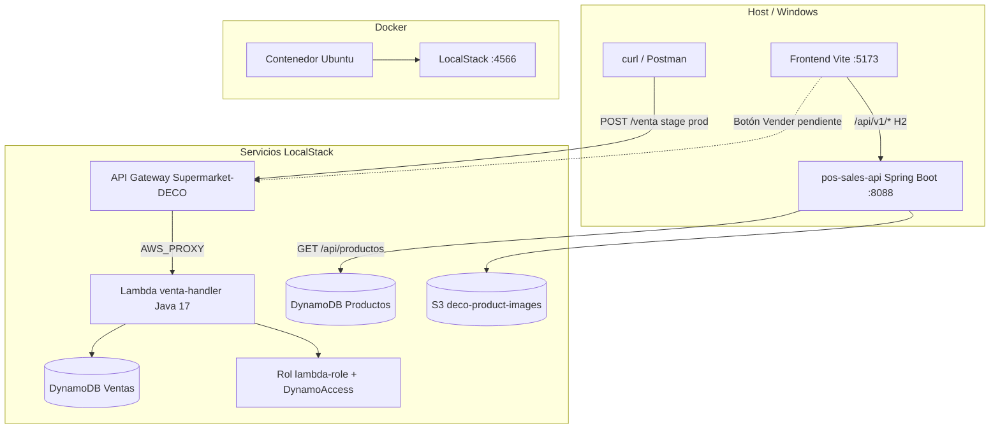
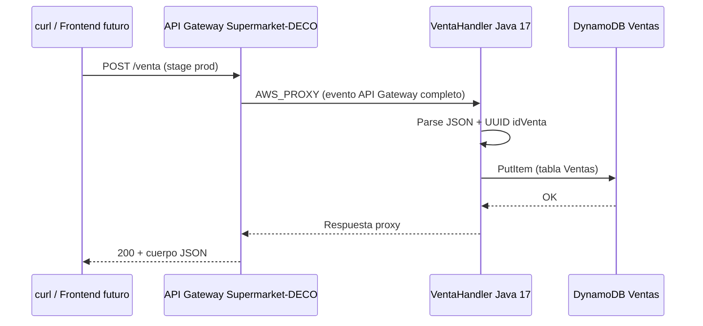
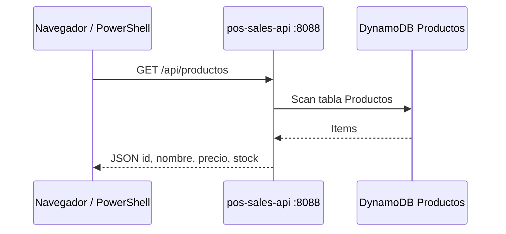

# Supermarket-DECO: Infraestructura Cloud (AWS + LocalStack)

Documentación del ecosistema **Supermarket-DECO**: arquitectura serverless emulada con **LocalStack**, integración con el monorepo POS (`pos-frontend` + `pos-sales-api`) y registro del trabajo realizado en el servidor simulado (contenedor Ubuntu + Docker).

**Endpoint LocalStack:** `http://localhost:4566` (desde el host) · `http://localhost.localstack.cloud:4566` (desde otros contenedores / Lambda).

---

## Arquitectura y flujo de datos

### Vista general



| Puerto / URL | Servicio |
|--------------|----------|
| **4566** | LocalStack (DynamoDB, S3, Lambda, API Gateway, IAM) |
| **8088** | `pos-sales-api` (Spring Boot) |
| **5173** | `pos-frontend` (Vite) |
| **localhost.localstack.cloud:4566** | Endpoint DynamoDB desde Lambda en contenedor |

### Flujo serverless de venta (implementado)



### Flujo catálogo inventario (Spring Boot)



---

## Mapa del recorrido (jornada de implementación)

Registro paso a paso de lo construido en el entorno simulado AWS.

### 1. El cimiento: entorno y LocalStack

| Paso | Detalle |
|------|---------|
| Contenedor | Ubuntu sobre Docker como entorno de trabajo |
| Herramientas | AWS CLI, **Java 17**, **Maven** |
| LocalStack | Simulador AWS sin costo real: **Lambda**, **API Gateway**, **DynamoDB**, IAM |
| Verificación | `curl http://localhost:4566/_localstack/health` → `"dynamodb": "running"` |

### 2. Desarrollo de la Lambda (el cerebro)

| Paso | Detalle |
|------|---------|
| Proyecto | Maven **`lambda-ventas`**, Java 17 |
| `pom.xml` | `aws-lambda-java-core`, `aws-lambda-java-events`, SDK DynamoDB |
| Código | **`VentaHandler.java`** — recibe JSON, genera **UUID** (`idVenta`), persiste en DynamoDB |
| Empaquetado | **maven-shade-plugin** → Fat JAR con todas las dependencias |
| Handler | `com.supermarket.lambda.VentaHandler::handleRequest` |

```bash
cd lambda-ventas
mvn clean package
# Artefacto: target/*-shaded.jar
```

### 3. API Gateway (la puerta)

| Paso | Detalle |
|------|---------|
| REST API | **`Supermarket-DECO`** |
| Recurso | `/venta` |
| Método | **POST** |
| Integración | Lambda, ajustada a **AWS_PROXY** (Lambda Proxy Integration) |
| Stage | **`prod`** — API accesible desde fuera del contenedor |

> Se probaron integraciones Proxy vs. No-Proxy; la configuración final **AWS_PROXY** entrega el evento completo a la Lambda y evita errores de parseo del body.

**URL típica (LocalStack):**

```text
http://localhost:4566/restapis/<api-id>/prod/_user_request_/venta
```

### 4. Base de datos y seguridad (el almacén)

| Recurso | Valor |
|---------|--------|
| Tabla ventas | **`Ventas`** |
| Partition Key | **`idVenta`** (String) |
| Rol IAM | **`lambda-role`** |
| Política | **`DynamoAccess`** — permiso de escritura en DynamoDB |
| Red | Endpoint **`localhost.localstack.cloud:4566`** en el código Java de la Lambda (comunicación entre contenedores Docker) |

**Crear tabla Ventas:**

```bash
aws --endpoint-url=http://localhost:4566 dynamodb create-table \
  --table-name Ventas \
  --attribute-definitions AttributeName=idVenta,AttributeType=S \
  --key-schema AttributeName=idVenta,KeyType=HASH \
  --billing-mode PAY_PER_REQUEST
```

### 5. Pruebas y éxito

| Prueba | Resultado |
|--------|-----------|
| Deployment | Stage **prod** desplegado |
| **curl** | Envío de ventas de prueba (ej. **Arroz**, **Manzanas**) vía `POST /venta` |
| **scan** | Verificación en DynamoDB de que los registros se guardan con todos los campos |
| Integración | **AWS_PROXY** — el JSON llega íntegro a la Lambda y a la tabla **Ventas** |

**Ejemplo de prueba (ajusta la URL con tu `api-id`):**

```bash
curl -X POST "http://localhost:4566/restapis/<API_ID>/prod/_user_request_/venta" \
  -H "Content-Type: application/json" \
  -d '{"producto":"Arroz","cantidad":2,"precio":4500}'
```

**Verificar persistencia:**

```bash
aws --endpoint-url=http://localhost:4566 dynamodb scan --table-name Ventas
```

**Borrar registros de prueba (opcional):**

```bash
# Por clave conocida
aws --endpoint-url=http://localhost:4566 dynamodb delete-item \
  --table-name Ventas \
  --key '{"idVenta":{"S":"<UUID-de-la-venta>"}}'

# O vaciar en desarrollo: eliminar y recrear la tabla
aws --endpoint-url=http://localhost:4566 dynamodb delete-table --table-name Ventas
```

---

## ¿Dónde estamos ahora?

| Área | Estado |
|------|--------|
| **Backend serverless** | ✅ Funcional — Lambda + API Gateway + DynamoDB **Ventas** |
| **Integración AWS_PROXY** | ✅ Configurada — body JSON sin pérdida de parseo |
| **Catálogo inventario** | ✅ Tabla **Productos** + `GET /api/productos` en Spring Boot |
| **POS monorepo** | ⏳ Front y catálogo H2 aún no unificados con flujo serverless |
| **Siguiente hito sugerido** | Integrar botón **Vender** (React) → `POST /venta` · CORS en API Gateway |

---

## 1. Componentes implementados

### A. Almacenamiento de imágenes (AWS S3)

| Recurso | Valor |
|---------|--------|
| **Bucket** | `deco-product-images` |
| **SDK Spring** | `S3Client` con `forcePathStyle(true)` en `AwsConfig` |

```bash
aws --endpoint-url=http://localhost:4566 s3 mb s3://deco-product-images
aws --endpoint-url=http://localhost:4566 s3 ls
```

---

### B. DynamoDB — Inventario (`Productos`)

Catálogo de productos para consultas rápidas (integrado con `pos-sales-api`).

| Recurso | Valor |
|---------|--------|
| **Tabla** | `Productos` |
| **Partition Key** | `Id` (String) |
| **Atributos** | `Nombre`, `Precio`, `Stock` |

```bash
aws --endpoint-url=http://localhost:4566 dynamodb scan --table-name Productos
```

**API Spring Boot:** `GET http://localhost:8088/api/productos`

---

### C. DynamoDB — Ventas (`Ventas`)

Persistencia de transacciones generadas por la Lambda.

| Recurso | Valor |
|---------|--------|
| **Tabla** | `Ventas` |
| **Partition Key** | `idVenta` (String, UUID en handler) |
| **Escritura** | Lambda `VentaHandler` con rol `lambda-role` |

```bash
aws --endpoint-url=http://localhost:4566 dynamodb scan --table-name Ventas
```

---

### D. Lambda + IAM (`lambda-ventas`)

| Parámetro | Valor |
|-----------|--------|
| **Proyecto** | `lambda-ventas` (Maven, Java 17) |
| **Handler** | `com.supermarket.lambda.VentaHandler::handleRequest` |
| **Rol** | `lambda-role` |
| **Política** | `DynamoAccess` |
| **Endpoint DynamoDB en Lambda** | `http://localhost.localstack.cloud:4566` |

```bash
cd lambda-ventas && mvn clean package

aws --endpoint-url=http://localhost:4566 lambda create-function \
  --function-name venta-handler \
  --runtime java17 \
  --handler com.supermarket.lambda.VentaHandler::handleRequest \
  --role arn:aws:iam::000000000000:role/lambda-role \
  --zip-file fileb://target/lambda-ventas-1.0.0-shaded.jar
```

---

### E. API Gateway (`Supermarket-DECO`)

| Parámetro | Valor |
|-----------|--------|
| **API** | `Supermarket-DECO` |
| **Ruta** | `POST /venta` |
| **Integración** | **AWS_PROXY** → Lambda `venta-handler` |
| **Stage** | `prod` |

---

## 2. Integración en `pos-sales-api` (monorepo)

Backend Spring Boot en paralelo al flujo serverless: no reemplaza la Lambda, complementa el catálogo.

| Archivo | Rol |
|---------|-----|
| `application.properties` | `aws.endpoint`, `aws.region`, tabla `Productos` |
| `AwsConfig.java` | `DynamoDbClient`, `DynamoDbEnhancedClient`, `S3Client` |
| `ProductoEntity.java` | Mapeo Enhanced (`Id`, `Nombre`, `Precio`, `Stock`) |
| `ProductoController.java` | `GET /api/productos` |

```properties
aws.endpoint=http://localhost:4566
aws.region=us-east-1
aws.dynamodb.productos-table=Productos
```

---

## 3. Task List de Requerimientos (Supermarket-DECO)

| Tarea / Requerimiento | Estado |
|-----------------------|--------|
| Infraestructura Base (LocalStack) | ✅ Completado |
| Lógica Serverless (Lambda Java 17) | ✅ Completado |
| Exposición de Servicios (API Gateway) | ✅ Completado |
| Tabla DynamoDB **Ventas** + IAM + pruebas curl/scan | ✅ Completado |
| Integración **AWS_PROXY** en `POST /venta` | ✅ Completado |
| Conexión Spring Boot → S3 (Subida de fotos) | ⏳ Pendiente |
| Sincronización H2 → DynamoDB **Productos** | ⏳ Pendiente |
| Integración React → API Gateway (Botón Vender) | ⏳ Pendiente |
| Configuración de CORS (Acceso navegador) | ⏳ Pendiente |

---

## 4. Catálogo del frontend vs bases de datos

| Flujo | Endpoint | Almacenamiento |
|-------|----------|----------------|
| Admin POS (`/products`) | `/api/v1/products` | H2 en memoria (JPA) |
| Inventario cloud (API Java) | `GET /api/productos` | DynamoDB **Productos** |
| Venta serverless | `POST /venta` (API Gateway) | DynamoDB **Ventas** vía Lambda |

Crear un producto en el frontend **no** aparece en **Productos** ni dispara **Ventas** hasta integrar esos flujos.

---

## 5. Comandos de verificación (checklist)

### 5.1 LocalStack

```bash
curl -s http://localhost:4566/_localstack/health
```

### 5.2 Tablas DynamoDB

```bash
aws --endpoint-url=http://localhost:4566 dynamodb list-tables
aws --endpoint-url=http://localhost:4566 dynamodb scan --table-name Productos
aws --endpoint-url=http://localhost:4566 dynamodb scan --table-name Ventas
```

### 5.3 Lambda y API Gateway

```bash
aws --endpoint-url=http://localhost:4566 lambda list-functions
aws --endpoint-url=http://localhost:4566 apigateway get-rest-apis
```

### 5.4 Spring Boot (Windows)

```powershell
.\start-dev.cmd
Invoke-RestMethod -Uri "http://localhost:8088/api/productos" -UseBasicParsing
```

---

## 6. Requisitos y variables de entorno

| Herramienta | Uso |
|-------------|-----|
| Docker + Ubuntu | Entorno de despliegue LocalStack |
| LocalStack | Emulación AWS |
| AWS CLI | Crear tablas, Lambda, API, pruebas |
| JDK 17 + Maven | Lambda y `pos-sales-api` |
| Node.js 18+ | Frontend |

```bash
export AWS_ACCESS_KEY_ID=test
export AWS_SECRET_ACCESS_KEY=test
export AWS_DEFAULT_REGION=us-east-1
```

**Maven en Windows:** usar `run-api.cmd` / `.\start-dev.cmd` (repo en `%LOCALAPPDATA%\maven-repo`).

---

## 7. Solución de problemas

| Síntoma | Causa probable | Acción |
|---------|----------------|--------|
| Lambda no escribe en DynamoDB | Rol IAM o endpoint incorrecto | Verificar `lambda-role`, `DynamoAccess`, `localhost.localstack.cloud:4566` |
| Error de parseo en venta | Integración No-Proxy | Usar **AWS_PROXY** en API Gateway |
| `Connection refused` desde Lambda | `localhost:4566` dentro de contenedor | Usar `localhost.localstack.cloud:4566` |
| `GET /api/productos` → `[]` | Tabla **Productos** vacía | `put-item` o scan en LocalStack |
| Producto del front no en DynamoDB | Rutas H2 vs **Productos** | Normal hasta sincronizar |
| CORS en navegador → API Gateway | Sin headers CORS en GW | Pendiente configuración |
| `aws: command not found` | CLI no instalada | Instalar AWS CLI v2 |
| Maven `.m2` bloqueado | Permisos Windows | `run-api.cmd` |

---

## 8. Detalle técnico en el monorepo

| Componente | Servidor simulado | Código en repo |
|------------|-------------------|----------------|
| DynamoDB **Ventas** + Lambda + API GW | ✅ Desplegado y probado | Proyecto `lambda-ventas` (externo al monorepo) |
| DynamoDB **Productos** | ✅ Con datos | `GET /api/productos` |
| S3 `deco-product-images` | ✅ Bucket | Cliente S3; subida pendiente |
| React → `POST /venta` | — | Pendiente |
| H2 ↔ **Productos** | — | Pendiente |

---

## 9. Referencias

**Monorepo POS**

- `pos-sales-api/.../AwsConfig.java`
- `pos-sales-api/.../ProductoEntity.java`
- `pos-sales-api/.../ProductoController.java`
- `run-api.cmd`, `start-dev.cmd`

**Serverless (entorno Ubuntu / LocalStack)**

- Proyecto `lambda-ventas` → `VentaHandler.java`, `pom.xml` (shade)
- API `Supermarket-DECO` → `POST /venta` (stage `prod`, AWS_PROXY)
- Tablas DynamoDB: **Ventas** (`idVenta`), **Productos** (`Id`)
